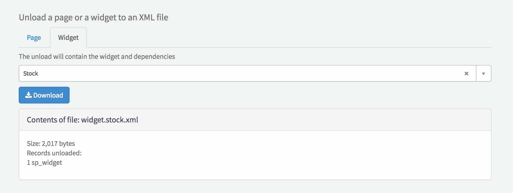

# x-unloader Widget
An easy way to export pages and widgets to an xml.

##Preview

## Installation

1. Go to [`x-unloader.xml`](src/x-unloader.xml?raw=true) and right click, Save As...
2. Go to your instance and import the downloaded xml file using [`x-loader.xml`](https://github.com/service-portal/x-loader)
3. Go to yourinstance/$sp.do?id=x-unloader to use the widget
